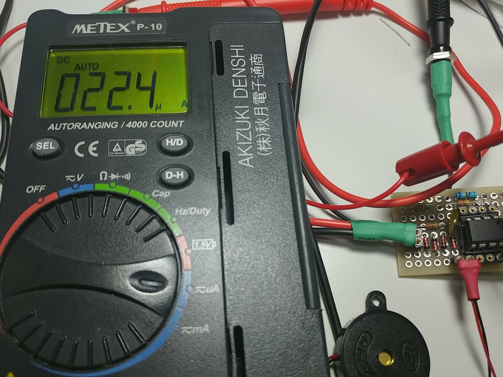

# ContinuityChecker_16f18313
---
PIC16F18313を使った導通チェッカーです。
約20Ωまで導通を音程で4段階通知します。

作成動機は愛用のMETEX P-10の導通を常用してるのですが、多用する導通モードに不満が...
* 導通モードにする手順が面倒
* 音がガリガリして不快
* P-10には愛着があるので、長持ちしてほしい

ということで仕様は
* すぐに使える
* 少ない部品で安価
* 幅広い抵抗(約20Ω)まで対応
* 音がいい
    * 音程も操作
        * 演奏もできれば...

---
### ソフトウエア
#### プログラム開発環境
MPLBX v4.15 + XC8 V1.45 + MCC(??)
MCCで生成されたルーチンを呼び出して利用しています。
作成時の労力７０％をNCO演奏ルーチンに入れてます。
* 使用しているPIC内蔵モジュール
    * 起動時
        * クロック 1MHz
        * 演奏 DSM, NCO
        * 測定 CMP1+DAC, ADC+FVR(1.024V)
        * 動作監視 WDT
    * SLEEP時
        * 測定 CMP1+DAC

10bit ADCをFVR 1.024Vで分解能1mV
バッテリーの残量が測定値に影響

---
### ハードウエア
#### 回路図

<https://upverter.com/kane4d/af89b0783d48c27a/Continuity-Checker-PIC16F18313>

消費電力は
* ピークは演奏時 600uA
* SLEEP時 22.4uA
ボタン電池CR2032(240mAh)で恐らく1年は持ちます。　

#### 部品表
実際にはD1、D2のダイオードは安価な1N4148を使っています。
METEX P-09のジャンク部品
| 部品番号 | 数量 |品名|型番|説明|
|---|---|---|---|---|
|U1|1|マイコン|PIC16F18313
|D..|4|ダイオード|1N4148|
|R3|1|抵抗|1kΩ|
|R4|1|抵抗|10kΩ|
|R5|1|抵抗|10kΩ|
|R6|1|抵抗|5.1kΩ|
|C1|1|コンデンサ|2.2ｎF|
|C2|1|コンデンサ|100ｎF|
|LS1|1|圧電スピーカー|適当|
|BASE|1|基板|秋月E型基板|
|BAT|1|ボタン電池|CR2032|3Vの電池ならどれでもOK|

#### 新旧、試作品

---
### 参照
[ChaNさま:回路内導通チェッカ](http://elm-chan.org/works/cch/report.html)
[獣医さんの電子工作とパソコン研究室さま:導通チェッカーの製作](http://cac-japan.com/electronics/ContinuityTester/)
